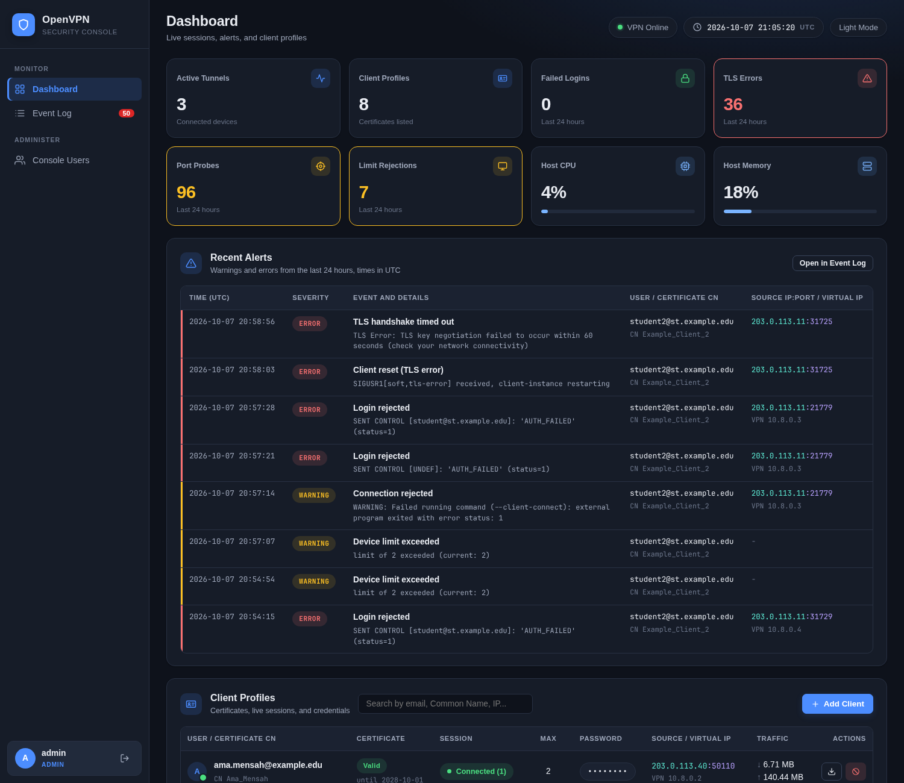
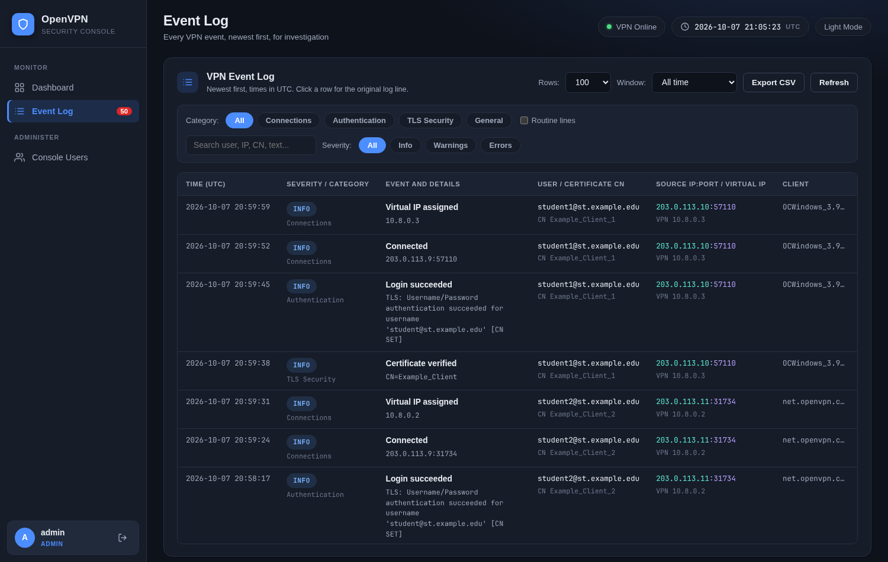

# OpenVPN Admin UI

A web console for running an OpenVPN server: issue and revoke client certificates,
hand out connection profiles, set a password and a device limit per client, see who
is connected, and investigate the server log.

Built for the ICT staff of the University of Mines and Technology (UMaT).



Every name, address, and value in the screenshots is invented sample data.

## How this project was built

The code in this repository was written entirely by AI coding assistants. The
direction was human: Abdullah Armiyao set the requirements, called the shots, and
made every decision the assistants worked from, including what to build, how it
should behave, what to change, and what to ship.

## Features

- Create a client: certificate, username, connection password, and a limit on
  simultaneous devices, in one form.
- Download a ready-to-import `.ovpn` profile for any valid client.
- Revoke a certificate. The certificate revocation list is regenerated and loaded
  by OpenVPN.
- Operations-console interface: a sidebar with icons and an account card, a top
  bar with a UTC clock and the VPN server's state, counter cards with usage
  bars, avatars and session pills, and monospace values for data.
- Dashboard with 24-hour counters for failed logins, TLS errors, port probes,
  and device-limit rejections, plus a panel of the most recent alerts.
- Live view of every client: certificate status, expiry, session state, source
  address, VPN address, and traffic counters.
- Event log built for incident response. Each event is a table row with time
  (UTC), severity, category, event name and details, user, certificate CN, source
  IP and port, VPN address, client software, and the original log line. Filter by
  category, severity, and time window. Export to CSV.
- Two roles for console accounts: `admin` (full control) and `user` (view and
  download, with VPN passwords withheld).
- Host CPU and memory tiles read from `/proc`.
- Audit trail of administrative actions in the service log.
- One configuration file for every site-specific value, including the display
  name and the colour palette.
- Light and dark themes. No fonts, scripts, or styles are loaded from third
  parties.



## How it fits together

```
Browser  ->  Flask app (gunicorn)  ->  Easy-RSA PKI directory
                    |                  JSON data files
                    |                  OpenVPN status file and log
                    v
             OpenVPN server  ->  verify-user-pass.py   (checks username and password)
                             ->  limit-connections.py  (enforces the device limit)
```

The web app and the two hook scripts share a small set of JSON files. The web app
writes them; OpenVPN's hooks read them each time a client connects.

## Requirements

- Debian or Ubuntu server with systemd
- OpenVPN already configured as a server (the project is run against OpenVPN 2.7)
- An Easy-RSA 3 PKI directory with an initialised CA
- Python 3 with `venv`
- Root access for installation

## Quick start

```bash
sudo bash scripts/install.sh
```

The installer creates a virtual environment, asks for the deployment's paths and
an admin account, writes `config.json` and `ui-users.json`, and installs and
starts the `openvpn-ui` systemd service. Read
[docs/installation.md](docs/installation.md) first: the OpenVPN server needs
several directives for the UI to work.

## Documentation

| Document | Contents |
|---|---|
| [docs/project.md](docs/project.md) | Why the project exists, what it does, how it is designed |
| [docs/installation.md](docs/installation.md) | Prerequisites, OpenVPN directives, install, verify, uninstall |
| [docs/configuration.md](docs/configuration.md) | Every setting, file location, and data file |
| [docs/usage.md](docs/usage.md) | Day-to-day operation of the console |
| [docs/api.md](docs/api.md) | HTTP endpoints, parameters, and responses |
| [docs/explainer.md](docs/explainer.md) | Every module, function, variable, and data structure |
| [docs/security.md](docs/security.md) | Security model, review results, and known limitations |
| [CHANGELOG.md](CHANGELOG.md) | History of changes |

## Project layout

```
app.py                  Flask backend: routes, PKI operations, log parsing
settings.py             Loads config.json for the app and the hooks
vpncrypto.py            Encryption of stored VPN passwords
verify-user-pass.py     OpenVPN hook: username and password check
limit-connections.py    OpenVPN hook: per-client device limit
config.example.json     Configuration template
templates/              index.html (console), login.html
static/                 app.js, style.css
scripts/                install.sh, uninstall.sh
requirements.txt        Python dependencies
docs/                   Documentation
```

## Author

Abdullah Armiyao

## License

MIT. See [LICENSE](LICENSE).
